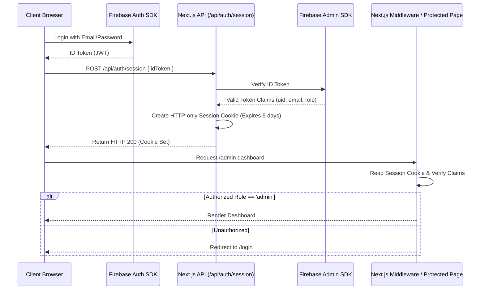
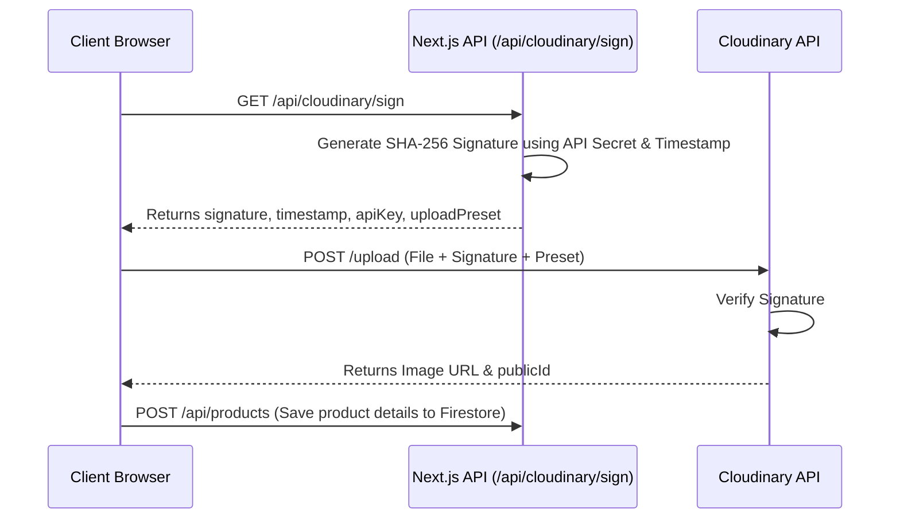
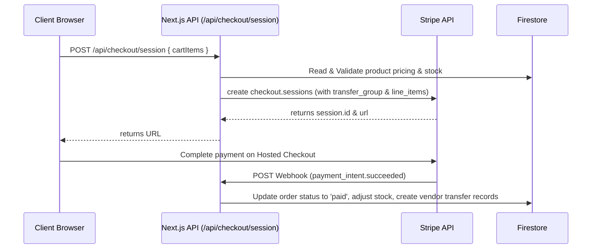

# Enterprise-Grade Multi-Vendor eCommerce Architecture Blueprint

This document outlines the complete production-grade, highly scalable multi-vendor eCommerce architecture using **Next.js (App Router)**, **Firebase Firestore**, **Cloudinary**, and **Stripe**. It is designed for optimal performance, extreme security, premium user experience, and seamless scalability.

---

## 1. Project Directory Structure

A clean, modular, and domain-driven directory structure using Next.js App Router.

```text
glimore-style/
├── .env.example
├── .gitignore
├── firestore.rules          # Production Firestore Security Rules
├── storage.rules            # Firebase Storage Security Rules (if fallback)
├── next.config.js           # Optimized Next.js configurations
├── tailwind.config.js       # Premium styling system config
├── tsconfig.json
├── package.json
├── src/
│   ├── app/                 # Next.js App Router (Routing and Pages)
│   │   ├── (auth)/          # Authentication Group
│   │   │   ├── login/
│   │   │   ├── register/
│   │   │   └── layout.tsx
│   │   ├── (shop)/          # Customer-Facing Shop Pages
│   │   │   ├── page.tsx     # Homepage (ISR)
│   │   │   ├── products/
│   │   │   │   ├── page.tsx # Search & Filters (Server-rendered)
│   │   │   │   └── [slug]/  # Dynamic Product Details (ISR + Dynamic Params)
│   │   │   ├── cart/        # Cart Page (Client-side state + Server validation)
│   │   │   ├── checkout/    # Stripe Checkout Page
│   │   │   └── order-success/
│   │   ├── admin/           # Super Admin Dashboard
│   │   │   ├── page.tsx
│   │   │   ├── vendors/
│   │   │   └── layout.tsx
│   │   ├── vendor/          # Vendor Dashboard
│   │   │   ├── page.tsx
│   │   │   ├── products/
│   │   │   └── layout.tsx
│   │   ├── api/             # API Routes (Edge/Node.js)
│   │   │   ├── auth/session/
│   │   │   ├── cloudinary/sign/
│   │   │   ├── checkout/session/
│   │   │   └── webhooks/stripe/
│   │   └── layout.tsx       # Global Layout (Navbar, Footer, Providers)
│   ├── components/          # Reusable UI & Complex Components
│   │   ├── ui/              # Atom level design elements (Buttons, Inputs, Modals)
│   │   ├── shop/            # Shop components (ProductCard, FilterSidebar)
│   │   ├── admin/           # Admin-specific UI elements
│   │   ├── vendor/          # Vendor-specific UI elements
│   │   └── shared/          # Shared complex components (ImageUpload, SearchBar)
│   ├── config/              # Centralized environment & third-party configs
│   │   ├── firebase.ts      # Firebase Client Initialization
│   │   ├── firebase-admin.ts# Firebase Admin SDK (Server-only)
│   │   ├── stripe.ts        # Stripe Client & SDK configs
│   │   └── cloudinary.ts    # Cloudinary configs
│   ├── context/             # Global React State Contexts
│   │   ├── AuthContext.tsx  # User auth state synchronizer
│   │   └── CartContext.tsx  # Client-side shopping cart provider
│   ├── hooks/               # Custom React Hooks
│   │   ├── useAuth.ts
│   │   ├── useCart.ts
│   │   └── useFirestoreQuery.ts
│   ├── lib/                 # Third-party wrappers, utilities, schemas
│   │   ├── firestore/       # Firestore query helpers
│   │   │   ├── products.ts
│   │   │   ├── orders.ts
│   │   │   └── users.ts
│   │   ├── validations/     # Zod schemas (forms, request validation)
│   │   │   ├── product.ts
│   │   │   └── order.ts
│   │   └── utils.ts         # Formatting, CN (Tailwind-merge)
│   └── types/               # Global TypeScript Interfaces
│       ├── index.d.ts
│       ├── product.ts
│       └── order.ts
```

---

## 2. Firestore Database Schema

Designed for high-performance reads, strict relational constraints, and scalable denormalization to keep query costs minimal.

### Collections and Documents

#### `users` (Collection)
```typescript
interface UserDocument {
  uid: string;                 // Matches Firebase Auth UID
  email: string;
  displayName: string;
  role: 'customer' | 'vendor' | 'admin';
  createdAt: FieldValue;       // Firestore Server Timestamp
  updatedAt: FieldValue;
  vendorId?: string;           // Present if role is 'vendor'
  shippingAddress?: {
    line1: string;
    line2?: string;
    city: string;
    state: string;
    postalCode: string;
    country: string;
  };
}
```

#### `vendors` (Collection)
```typescript
interface VendorDocument {
  id: string;
  name: string;
  logoUrl: string;
  description: string;
  ownerUid: string;            // References users.uid
  stripeAccountId: string;     // Stripe Connect Account ID for payouts
  status: 'pending' | 'approved' | 'suspended';
  rating: number;
  reviewsCount: number;
  createdAt: FieldValue;
}
```

#### `products` (Collection)
```typescript
interface ProductDocument {
  id: string;
  title: string;
  slug: string;                // URL-friendly slug, must be unique
  description: string;
  price: number;               // In cents (e.g., 9900 for $99.00)
  salePrice?: number;          // In cents (if on sale)
  images: {
    publicId: string;          // Cloudinary Public ID
    url: string;               // Optimized Cloudinary URL
    thumbnailUrl: string;
  }[];
  category: string;
  tags: string[];
  stock: number;
  vendorId: string;            // References vendors.id
  vendorName: string;          // Denormalized for high-performance reads
  status: 'draft' | 'active' | 'out-of-stock';
  averageRating: number;
  reviewsCount: number;
  createdAt: FieldValue;
  updatedAt: FieldValue;
}
```

#### `orders` (Collection)
```typescript
interface OrderDocument {
  id: string;                  // Matches Stripe Payment Intent ID or custom ID
  customerId: string;          // References users.uid
  customerEmail: string;
  items: {
    productId: string;
    title: string;
    quantity: number;
    price: number;             // Price at purchase time (in cents)
    vendorId: string;          // Track split orders for multi-vendor payout
    image: string;
  }[];
  totalAmount: number;         // Total in cents
  stripePaymentIntentId: string;
  paymentStatus: 'pending' | 'paid' | 'failed' | 'refunded';
  shippingStatus: 'processing' | 'shipped' | 'delivered' | 'cancelled';
  shippingAddress: UserDocument['shippingAddress'];
  createdAt: FieldValue;
  updatedAt: FieldValue;
}
```

#### `carts` (Collection - Server side synchronization)
```typescript
interface CartDocument {
  userId: string;              // References users.uid
  items: {
    productId: string;
    quantity: number;
  }[];
  updatedAt: FieldValue;
}
```

---

## 3. Authentication & Role-Based Access Control (RBAC)

To guarantee high security, Next.js Middleware acts as the gatekeeper. We synchronize the client-side Firebase authentication state with a secure server-side HTTP-only session cookie.



### Next.js Middleware (`src/middleware.ts`)
```typescript
import { NextResponse } from 'next/server';
import type { NextRequest } from 'next/server';

export async function middleware(request: NextRequest) {
  const session = request.cookies.get('session')?.value;

  // Protect /admin routes
  if (request.nextUrl.pathname.startsWith('/admin')) {
    if (!session) {
      return NextResponse.redirect(new URL('/login', request.url));
    }

    // Call API / Firebase Admin to verify session token and fetch custom claim role
    try {
      const response = await fetch(`${request.nextUrl.origin}/api/auth/verify-role`, {
        headers: { Cookie: `session=${session}` },
      });
      const data = await response.json();

      if (data.role !== 'admin') {
        return NextResponse.redirect(new URL('/', request.url));
      }
    } catch {
      return NextResponse.redirect(new URL('/login', request.url));
    }
  }

  // Protect /vendor routes
  if (request.nextUrl.pathname.startsWith('/vendor')) {
    if (!session) {
      return NextResponse.redirect(new URL('/login', request.url));
    }

    try {
      const response = await fetch(`${request.nextUrl.origin}/api/auth/verify-role`, {
        headers: { Cookie: `session=${session}` },
      });
      const data = await response.json();

      if (data.role !== 'vendor') {
        return NextResponse.redirect(new URL('/', request.url));
      }
    } catch {
      return NextResponse.redirect(new URL('/login', request.url));
    }
  }

  return NextResponse.next();
}

export const config = {
  matcher: ['/admin/:path*', '/vendor/:path*'],
};
```

---

## 4. Secure Cloudinary Image Upload System

Images are uploaded **directly from the client browser** to Cloudinary to bypass the server bottlenecks, but are fully secured using **Signed Upload Presets** generated by our secure API route.



### Signature API Route (`src/app/api/cloudinary/sign/route.ts`)
```typescript
import { NextResponse } from 'next/server';
import { v2 as cloudinary } from 'cloudinary';

cloudinary.config({
  cloud_name: process.env.NEXT_PUBLIC_CLOUDINARY_CLOUD_NAME,
  api_key: process.env.CLOUDINARY_API_KEY,
  api_secret: process.env.CLOUDINARY_API_SECRET,
});

export async function GET() {
  const timestamp = Math.round(new Date().getTime() / 1000);
  const paramsToSign = {
    timestamp,
    folder: 'glimore-style-products',
    upload_preset: process.env.CLOUDINARY_UPLOAD_PRESET,
  };

  const signature = cloudinary.utils.api_sign_request(
    paramsToSign,
    process.env.CLOUDINARY_API_SECRET!
  );

  return NextResponse.json({
    signature,
    timestamp,
    apiKey: process.env.CLOUDINARY_API_KEY,
    uploadPreset: process.env.CLOUDINARY_UPLOAD_PRESET,
    cloudName: process.env.NEXT_PUBLIC_CLOUDINARY_CLOUD_NAME,
  });
}
```

---

## 5. Stripe Multi-Vendor Checkout Integration

Using Stripe Connect, customers make a single purchase, and Stripe automatically splits payments, routing appropriate funds directly to individual Vendor Stripe Accounts while collecting a platform fee.



### Stripe Webhook Handler (`src/app/api/webhooks/stripe/route.ts`)
```typescript
import { headers } from 'next/headers';
import { NextResponse } from 'next/server';
import stripe from '@/config/stripe';
import { dbAdmin } from '@/config/firebase-admin';
import Stripe from 'stripe';

export async function POST(req: Request) {
  const body = await req.text();
  const signature = headers().get('stripe-signature') as string;

  let event: Stripe.Event;

  try {
    event = stripe.webhooks.constructEvent(
      body,
      signature,
      process.env.STRIPE_WEBHOOK_SECRET!
    );
  } catch (err: any) {
    return NextResponse.json({ error: `Webhook Error: ${err.message}` }, { status: 400 });
  }

  if (event.type === 'checkout.session.completed') {
    const session = event.data.object as Stripe.Checkout.Session;
    const metadata = session.metadata;

    if (metadata && metadata.orderId) {
      const batch = dbAdmin.batch();
      const orderRef = dbAdmin.collection('orders').doc(metadata.orderId);

      batch.update(orderRef, {
        paymentStatus: 'paid',
        stripePaymentIntentId: session.payment_intent as string,
        updatedAt: new Date(),
      });

      // Fetch the order items to update stock
      const orderDoc = await orderRef.get();
      const orderData = orderDoc.data();

      if (orderData) {
        orderData.items.forEach((item: any) => {
          const productRef = dbAdmin.collection('products').doc(item.productId);
          batch.update(productRef, {
            stock: dbAdmin.FieldValue.increment(-item.quantity),
          });
        });
      }

      await batch.commit();
    }
  }

  return NextResponse.json({ received: true });
}
```

---

## 6. Dashboards Architectures (Admin & Vendor)

To support dual interfaces securely and optimally, we build dedicated dashboard paths with separated state management.

### Super Admin Dashboard
- **Target**: Platform Managers.
- **Key Views**: 
  - Revenue analytics and platform fee optimization charts.
  - Multi-vendor application approval workflow.
  - Full catalog auditing & moderation capability.
  - System logs and platform adjustments.

### Vendor Dashboard
- **Target**: Verified Merchants.
- **Key Views**:
  - Independent store profile configuration.
  - Zod-validated Product onboarding forms with Drag-and-Drop Cloudinary upload.
  - Detailed Order processing screen.
  - Stripe Connect payout monitoring panel.

---

## 7. Cart State & Optimistic Inventory Checkout

A robust local storage custom hook manages customer carts with full server-side validations at the checkout step to protect against malicious modifications or double-bookings.

### Robust Client Cart Context State (`src/context/CartContext.tsx`)
```typescript
'use client';

import React, { createContext, useContext, useState, useEffect } from 'react';

interface CartItem {
  productId: string;
  title: string;
  price: number;
  quantity: number;
  image: string;
  vendorId: string;
}

interface CartContextType {
  cart: CartItem[];
  addToCart: (item: CartItem) => void;
  removeFromCart: (productId: string) => void;
  updateQuantity: (productId: string, quantity: number) => void;
  clearCart: () => void;
  cartTotal: number;
}

const CartContext = createContext<CartContextType | undefined>(undefined);

export const CartProvider: React.FC<{ children: React.ReactNode }> = ({ children }) => {
  const [cart, setCart] = useState<CartItem[]>([]);

  useEffect(() => {
    const savedCart = localStorage.getItem('glimore_cart');
    if (savedCart) setCart(JSON.parse(savedCart));
  }, []);

  const saveCart = (newCart: CartItem[]) => {
    setCart(newCart);
    localStorage.setItem('glimore_cart', JSON.stringify(newCart));
  };

  const addToCart = (newItem: CartItem) => {
    const existing = cart.find(i => i.productId === newItem.productId);
    if (existing) {
      saveCart(cart.map(i => i.productId === newItem.productId ? { ...i, quantity: i.quantity + newItem.quantity } : i));
    } else {
      saveCart([...cart, newItem]);
    }
  };

  const removeFromCart = (productId: string) => {
    saveCart(cart.filter(i => i.productId !== productId));
  };

  const updateQuantity = (productId: string, quantity: number) => {
    saveCart(cart.map(i => i.productId === productId ? { ...i, quantity } : i));
  };

  const clearCart = () => saveCart([]);

  const cartTotal = cart.reduce((total, item) => total + (item.price * item.quantity), 0);

  return (
    <CartContext.Provider value={{ cart, addToCart, removeFromCart, updateQuantity, clearCart, cartTotal }}>
      {children}
    </CartContext.Provider>
  );
};

export const useCart = () => {
  const context = useContext(CartContext);
  if (!context) throw new Error('useCart must be used within CartProvider');
  return context;
};
```

---

## 8. Firestore & Cloud Storage Security Rules

Production-grade rules to lock down databases entirely. These guarantee that only validated entities can perform modifications.

### Firestore Security Rules (`firestore.rules`)
```javascript
rules_version = '2';
service cloud.firestore {
  match /databases/{database}/documents {
    
    // Function to check authentication status
    function isAuthenticated() {
      return request.auth != null;
    }
    
    // Function to verify ownership of a document
    function isOwner(userId) {
      return request.auth.uid == userId;
    }
    
    // Function to check user's roles
    function getUserData() {
      return get(/databases/$(database)/documents/users/$(request.auth.uid)).data;
    }
    
    function isAdmin() {
      return isAuthenticated() && getUserData().role == 'admin';
    }

    function isVendor() {
      return isAuthenticated() && getUserData().role == 'vendor';
    }

    // Users Collection
    match /users/{userId} {
      allow read: if isAuthenticated();
      allow write: if isAuthenticated() && isOwner(userId);
    }

    // Vendors Collection
    match /vendors/{vendorId} {
      allow read: if true; // Public marketplace
      allow create, update: if isAuthenticated() && (isOwner(resource.data.ownerUid) || isAdmin());
      allow delete: if isAdmin();
    }

    // Products Collection
    match /products/{productId} {
      allow read: if true;
      allow create: if isVendor() && request.resource.data.vendorId == getUserData().vendorId;
      allow update: if isVendor() && resource.data.vendorId == getUserData().vendorId;
      allow delete: if isAdmin() || (isVendor() && resource.data.vendorId == getUserData().vendorId);
    }

    // Orders Collection
    match /orders/{orderId} {
      allow read: if isAuthenticated() && (isOwner(resource.data.customerId) || isAdmin() || isVendor());
      allow create: if isAuthenticated();
      allow update, delete: if isAdmin(); // Strictly admin updates statuses (shipping, payment refunds)
    }
  }
}
```

---

## 9. Modern SEO & Performance Architecture

### SEO Best Practices
Next.js App Router incorporates deep metadata declarations to drive high organic search visibility.
- **Dynamic Metadata APIs**: Generated programmatically for products via `generateMetadata()` to include canonical links, high-quality OpenGraph tags, and JSON-LD structured schema.
- **Sitemap Optimization**: Clean routes using `app/sitemap.ts` to automatically query Firestore for active products and build a valid search engine crawler map.

### Premium Performance Optimization
- **Incremental Static Regeneration (ISR)**: The Dynamic homepage `/` and dynamic details `/products/[slug]` are set with `revalidate = 3600`. They serve instantly as static HTML and revalidate in the background every hour to minimize DB calls.
- **Dynamic Image Optimization**: Utilize Cloudinary's dynamic parameter features (e.g., `f_auto,q_auto,w_800`) to guarantee tiny image file sizes while utilizing the premium next/image wrapper for native lazy loading.
- **Optimized Server Component Prefetching**: Utilizing server components inside Next.js to run database calls close to database servers, sending pre-rendered visual components directly to client browsers.

---

## 10. Production Deployment & Enterprise Scaling Roadmap

### Enterprise Scale-Out Strategy
For when the business scales up to high concurrent user traffic:
1. **Dynamic Caching with Redis**: Introduce a global Redis cache (e.g., Upstash) between Firestore and Next.js Server Components to instantly serve catalog and category lookups.
2. **Instant Catalog Search (Algolia or Typesense)**: Set up a Cloud Firestore Trigger (Firebase Cloud Function) to synchronize active product creations, edits, and deletions into an Algolia index for instant, highly precise search with typo-tolerance.
3. **Advanced Rate Limiting**: Deploy Next.js to Vercel and leverage Vercel Edge Middleware or Cloudflare Workers to block suspicious bot crawls, secure API routes, and defend against brute-force DDoS.
4. **Automated Firestore Backup and Multi-Region Pipelines**: Deploy scheduled Cloud Tasks to run automated daily backups of Firestore databases and set up replicas to guarantee 99.999% high availability.

---

### Phase-by-Phase Roadmap to Final Implementation

1. **Step 1: Setup Local Project & Initial Styling**
   - Create Next.js project with TailwindCSS and shadcn/ui.
   - Configure global theme with elegant custom typography.
2. **Step 2: Database Initialization & Admin Setup**
   - Setup Firebase project and write safety Firestore Security Rules.
   - Setup Firebase Admin SDK in API routes.
3. **Step 3: Direct-to-Cloudinary Secure Direct Image Uploader**
   - Create signature generating API and drop-in dashboard uploader element.
4. **Step 4: Authentication Engine**
   - Combine Firebase Auth client with cookie authorization middleware.
5. **Step 5: Stripe Integration**
   - Code multi-vendor split checkouts and a webhook system to handle inventory and status edits.
6. **Step 6: Dashboard UIs & Launch**
   - Build custom views for both Admin and Merchant dashboards.
